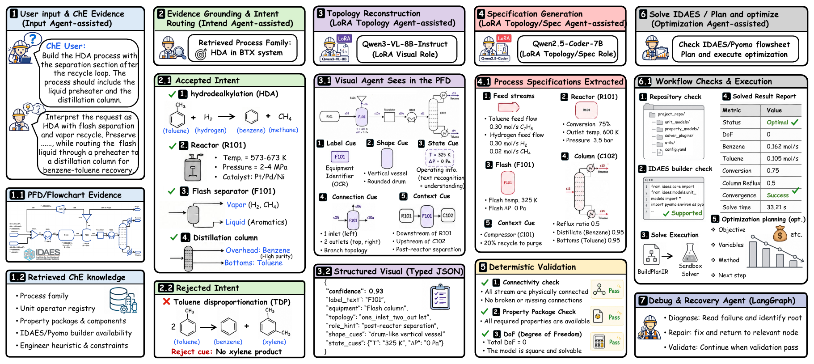

# CRAFTS

CRAFTS is a seven-agent, chemical-engineering-knowledge-informed LangGraph
workflow for constructing inspectable equation-oriented process models from
natural-language requirements and optional process-flow-diagram evidence.

The collaborating roles cover input understanding, intent routing, visual
description, topology generation, specification generation, debugging, and
optimization. Three schema-critical roles are fine-tuned for VisualGraphIR,
TopologyIR, and SpecIR generation. Deterministic gates validate the promoted
artifacts before model construction, solving, and eligible optimization;
unsupported or invalid trajectories fail closed.

## Paper

**[CRAFTS: Collaborative Role-Adaptive Fine-Tuning of LLM Agents for Chemical
Process Simulation](https://arxiv.org/abs/2608.01369)**

   
  <b>Figure 1.</b> CRAFTS replaces a closed black-box simulation loop with role-adapted agents over an inspectable IDAES/Pyomo execution substrate.

   
  <b>Figure 2.</b> End-to-end HDA example: evidence grounding, intent routing, typed visual, topology, and specification artifacts, deterministic validation, IDAES execution, optimization, and bounded recovery.

## Repository status

This repository currently provides a conservative architecture preview and
selected figures from the arXiv manuscript. It does not include source data,
benchmark records, model weights, evaluation references, or solver-output
artifacts.

The benchmark dataset and associated training and release materials are being
organized and audited for a later public release.

## Contact

Questions, feedback, or collaboration ideas are welcome. Feel free to contact me: "Ziyoon_Zhang@outlook.com"
