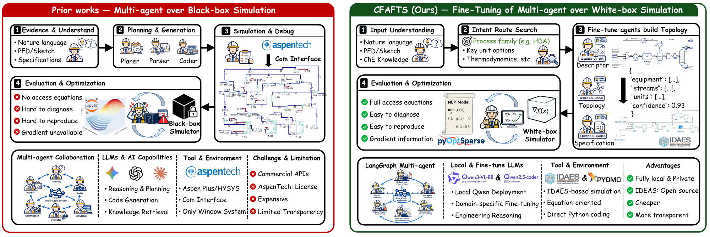

# CRAFTS

CRAFTS is a seven-agent, chemical-engineering-knowledge-informed LangGraph
workflow for constructing inspectable equation-oriented process models from
natural-language requirements and optional process-flow-diagram evidence.

The collaborating roles cover input understanding, intent routing, visual
description, topology generation, specification generation, debugging, and
optimization. Three schema-critical roles are fine-tuned for VisualGraphIR,
TopologyIR, and SpecIR generation. Deterministic gates validate the promoted
artifacts before model construction, solving, and eligible optimization;
unsupported or invalid trajectories fail closed.

## Paper

**[CRAFTS: Collaborative Role-Adaptive Fine-Tuning of LLM Agents for Chemical
Process Simulation](https://arxiv.org/abs/2608.01369)**

   
  <b>Figure 1.</b> CRAFTS replaces a closed black-box simulation loop with role-adapted agents over an inspectable IDAES/Pyomo execution substrate.

## OpenIDAES-450

**OpenIDAES-450 is available with 450 documented cases, Python model and solver
programs, recorded environments, and computed results.** Each case connects its
process description and specification to the implemented model, property-package
configuration where applicable, execution records, and available stream, unit or
optimization outputs.

**[Browse the 450 cases](demo/openidaes450/CASE_INDEX.md)** ·
**[Reproduce and inspect a case](demo/openidaes450/REPRODUCING_AND_INSPECTING.md)** ·
**[Download the complete package](https://github.com/Galigeigei-Z/CRAFTS-Multi-agent-for-Equation-oriented-PSE/releases/tag/openidaes450-demo-2026-09-26)**

The release provides:

- Descriptions, specifications, topologies and Python entry points for all 450 cases.
- Computed result tables with solver termination, model configuration and numerical diagnostics.
- Shared model sources, five runtime inventories, 39 package wheels, and detailed installation instructions.
- A searchable local case browser and machine-readable CSV/JSON catalogs.

The collection covers IDAES flowsheets, reduced process models, grid and design
optimization, and external dynamic simulation. The [model scope and validation
record](demo/openidaes450/MODEL_SCOPE.md) explains the model families, execution
evidence and case reproduction. Start with
[the setup guide](demo/openidaes450/SETUP_AND_USAGE.md) to select the appropriate
runtime and solver.

## Citation

If you find OpenIDAES-450 useful, can can cite our paper, [CRAFTS: Collaborative Role-Adaptive Fine-Tuning of LLM Agents for Chemical Process Simulation](https://arxiv.org/abs/2608.01369), and acknowledge the IDAES project.

## Acknowledgments

We thank the IDAES developers and contributors for the process-modeling framework,
unit-model and property-package libraries, examples, and open-source infrastructure
that support the IDAES-based cases and the CRAFTS execution workflow.

- [IDAES project website](https://idaes.org/)
- [IDAES source code on GitHub](https://github.com/IDAES/idaes-pse)
- [IDAES documentation](https://idaes-pse.readthedocs.io/en/stable/)
- [IDAES framework publication — Lee et al. (2021)](https://doi.org/10.1002/amp2.10095)

We also acknowledge [Pyomo](https://github.com/Pyomo/pyomo),
[WaterTAP](https://github.com/watertap-org/watertap), and the other upstream
projects identified in the case provenance and package inventories. Please cite
the relevant upstream software and model publications when using these materials.

## Contact

Questions, feedback, or collaboration ideas are welcome. Feel free to contact me: "Ziyun_Zhang@u.nus.edu/Ziyoon_Zhang@outlook.com"
